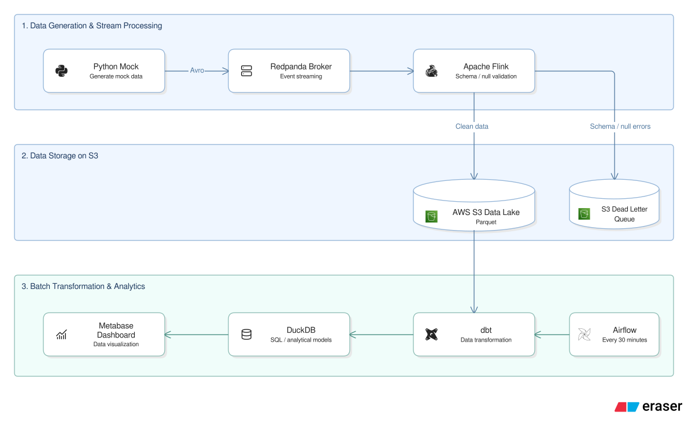

# E-Commerce Clickstream Analytics Pipeline

Real-time streaming and batch data platform processing clickstream events with schema enforcement, dead letter queue routing, and Medallion transformations.

## Architecture

[](docs/architecture.svg)

## Tech Stack

-  **Python** – Mock event generation with state machine & chaos injection
-  **Redpanda** – High-throughput message broker & Confluent-compatible Schema Registry
-  **Apache Flink** – Stream processing, 20s watermarks, and 3-way concurrent sink
-  **AWS S3** – Columnar Parquet data lake with Snappy compression & lifecycle policies
-  **Apache Airflow** – Orchestrates 30-minute batch transformation workflows
-  **dbt** – Medallion modeling (Silver Staging, SCD Type 2 Snapshots, Gold Marts)
-  **DuckDB** – In-process OLAP engine reading directly from S3 Parquet
-  **Metabase** – Interactive analytics dashboard for conversion funnels and revenue
-  **Docker** – Full local containerization across 10 coordinated services
-  **Terraform** – Infrastructure as Code with remote S3 backend state

## Performance & Processing Times

- **Stream Ingestion & Latency**: Consumes real-time events with sub-second broker latency and a **20-second watermark window** for handling out-of-order records.
- **Micro-batch Aggregation**: 1-minute tumbling windows compute real-time revenue and sink directly to S3.
- **Batch ELT Execution**: The 7-step dbt transformation DAG finishes in **~5 minutes** per 30-minute schedule using `BashOperator` (2x faster than Cosmos task overhead).
- **Storage Footprint**: Snappy-compressed Parquet partitioned by `event_date` reduces raw event storage by **~70%** compared to JSON/CSV.

## Fault Tolerance & Resilience

- **Dead Letter Queue (DLQ)**: Flink routes malformed records to `/dlq/` S3 partition, ensuring zero data loss and uninterrupted streaming.
- **Schema Enforcement**: Schema Registry validates Avro contracts on ingestion, rejecting non-compliant schemas.
- **Chaos Testing**: 1-2% corrupted payloads injected to continuously verify DLQ routing.
- **State Recovery**: 10-second S3 checkpoints (`RETAIN_ON_CANCELLATION`) ensure quick recovery without duplicate processing.
- **Concurrency & Alerting**: DuckDB `read_only=true` prevents file lock conflicts with Metabase; Airflow automates retries with email alerts.

## Data Schema

Core table: `clickstream_events`

| Group | Columns | Description |
| --- | --- | --- |
| **Session & User** | `session_id`, `client_id`, `user_id`, `ip_address` | Browser session, device client, user identity |
| **Device & Attribution** | `device_category`, `os_browser`, `utm_source` | Device platform, browser client, traffic source |
| **Event Details** | `event_id`, `event_timestamp`, `event_name`, `page_url` | UUID, epoch ms, action (`page_view` to `purchase`), URL |
| **E-Commerce Context** | `product_id`, `category`, `price`, `quantity`, `cart_total`, `transaction_id` | Catalog item details, cart balance, order ID |
| **Partition** | `event_date` | Date partition key (`YYYY-MM-DD`) |

## Setup Instructions

### 1. Clone & Configure

```bash
git clone https://github.com/hdminh279/e_commerce_clickstream_de_project.git
cd e_commerce_clickstream_de_project
cp .env.example .env
```

Configure credentials in `.env`:
```ini
AIRFLOW_UID=1000
AWS_ACCESS_KEY_ID=your_aws_access_key
AWS_SECRET_ACCESS_KEY=your_aws_secret_key
AWS_DEFAULT_REGION=ap-southeast-1
TARGET_S3_BUCKET=your_s3_bucket_name
FLINK_PARALLELISM=1
```

### 2. Deploy AWS Infrastructure & Dependencies

```bash
# Provision S3 buckets & lifecycle rules
cd infra && terraform init && terraform apply -auto-approve && cd ..

# Install Python packages locally
uv sync
```

### 3. Launch Services & Submit Flink Job

```bash
# Start 10 containerized services
docker compose up -d --build

# Submit PyFlink streaming job
docker compose exec jobmanager flink run -py /opt/src/job/store_data_s3.py
```

### 4. Run Event Generator & Airflow

```bash
# Start generating mock clickstream events
uv run scripts/mock_data.py

# Trigger Airflow batch pipeline (or enable schedule at http://localhost:8080)
docker compose exec airflow-webserver airflow dags trigger ecommerce_clickstream_pipeline
```

## Service Access

| Service | URL | Default Credentials |
| --- | --- | --- |
| Airflow Webserver | http://localhost:8080 | airflow / airflow |
| Flink Dashboard | http://localhost:8081 | - |
| Redpanda Console | http://localhost:8083 | - |
| Metabase UI | http://localhost:3000 | Configured on initial setup |
| Schema Registry | http://localhost:18081 | - |
| PostgreSQL | localhost:5432 | postgres / postgres |

## Testing

```bash
# Unit tests for event state machine
uv run pytest tests/test_mock_data.py -v

# dbt data quality and constraint tests
cd ecommerce_dbt && uv run dbt test --target dev
```
